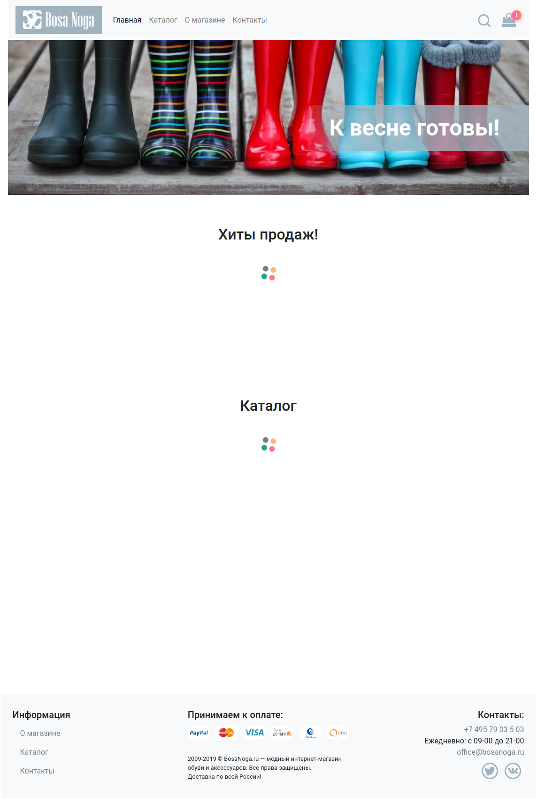
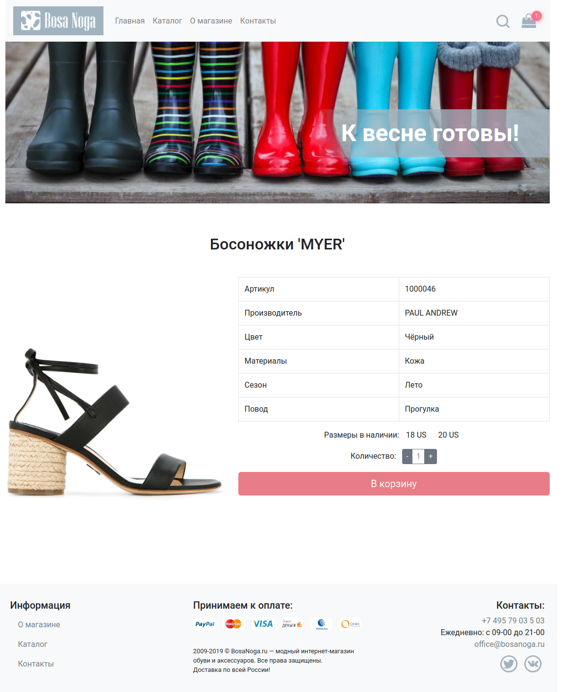
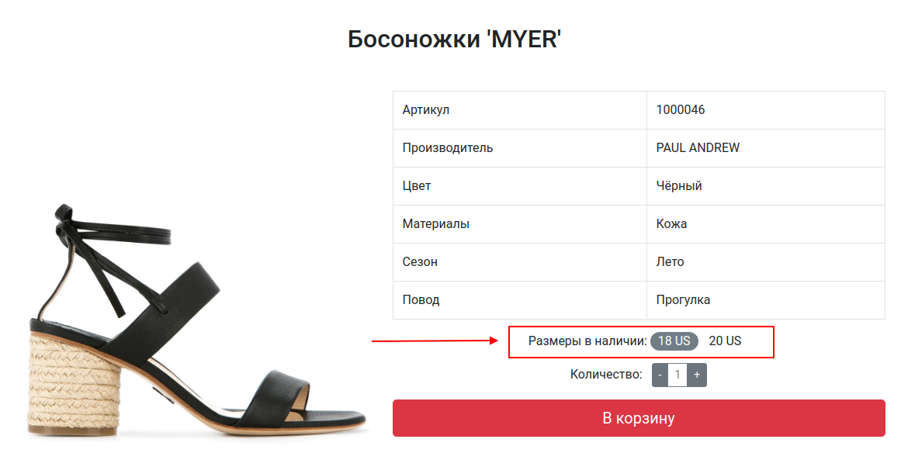
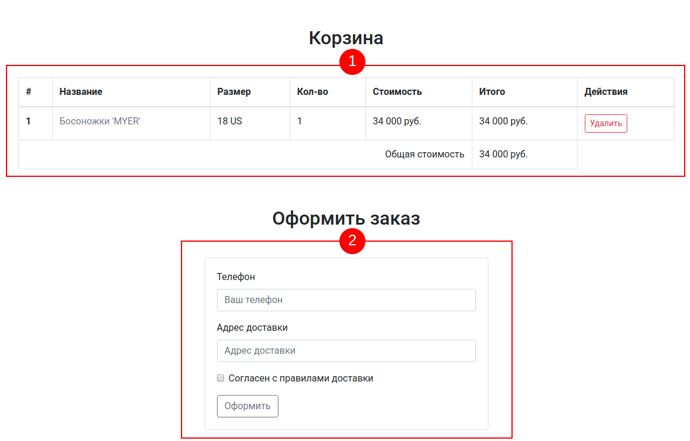
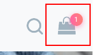

# React Diploma — Shoe Store

[](https://github.com/backsty/React-diploma/actions/workflows/deploy.yml)
[](https://github.com/backsty/React-diploma/actions/workflows/render-deploy.yml)
[](https://github.com/backsty/React-diploma/actions/workflows/ci.yml)

---

**Live demo:**  
🌐 [https://backsty.github.io/React-diploma/](https://backsty.github.io/React-diploma/)

**Backend API:**  
🔗 [https://react-diploma-backend-x0qm.onrender.com/api/items](https://react-diploma-backend-x0qm.onrender.com/api/items)

---

# Дипломный проект курса «React»

Дипломный проект представляет собой интернет-магазин обуви. Задача заключается в создании работающего приложения, всеми основными функциями которого можно пользоваться.

Как это всегда бывает, вы, фронтенд-разработчик, — последний в цепочке создания продукта, поэтому вам необходимо пользоваться результатами работы верстальщика и бекэнд-разработчика. И если результаты работы верстальщика вы ещё можете немного подправить, то бэкенд вы уже не имеете права редактировать.

Большая часть разметки и стилей уже реализована за вас и хранится в каталоге `html`. Как всегда, пояснений особо к разметке нет, так как, со слов верстальщика, «там и так всё понятно».

Перейдём к самому приложению.

## Обязательные условия

Все функции должны быть реализованы.

Внешний вид должен быть аналогичен тому, что представлен в разметке в каталоге `html`.

Бэкенд видоизменять нельзя.  
При необходимости опубликовать сервер в интернете, используйте [render.com](https://render.com/docs/your-first-deploy) или аналоги.  
Опубликованный сервер [react-diploma-backend.onrender.com](https://react-diploma-backend-x0qm.onrender.com/api/items), может работать с перебоями, т.к. используется бесплатный тариф `render.com`

Сервер запускается командой:

```bash
npm start
```

Если вы хотите проверить, как ваше приложение обрабатывает ошибки и задержки сервера, то:

```bash
npm install # зависимости нужно установить, т.к. нужно установить пакет cross-env
npm run flaky
```

Команды ниже не будут работать в cmd.exe и powershell, но должны работать в gitbash / wsl / linux / macos):

```bash
# сервер с задержками
APP_DELAY=true node src/index.mjs

# сервер с ошибками
APP_ERROR=true node src/index.mjs

# сервер с ошибками и задержками
APP_DELAY=true APP_ERROR=true node src/index.mjs
```

Для хранения состояния корзины и побочных эффектов могут использоваться:

- Context API + побочные эффекты в компонентах;
- Redux + побочные эффекты в компонентах, либо Action Creator;
- Redux + Redux Thunk;
- Redux + Redux Observable;
- Redux + Redux-saga.

Выбирайте любой удобный вам способ. Итоговая оценка не зависит от того, какой из пяти способов вы выберите.

Весь код должен быть выложен на GitHub в виде отдельного репозитория.

При оформлении кода рекомендуем вам опираться на стиль кодирования Airbnb: [Airbnb JavaScript Style Guide](https://github.com/airbnb/javascript) (именно JS, а не React).

Можете ознакомиться с [методическими рекомендациями по оценке диплома](./guidelines.md), в соответствии с которыми дипломные руководители будут оценивать вашу работу.

Важно: не забывайте показывать loader при загрузке и сообщение об ошибке, если с сервера вы её получили или вообще ничего не получили, например, у пользователя сейчас нет интернет-соединения.

## Вехи

На весь диплом даётся три недели, в соответствии с чем мы выделили ключевые вехи, которые отражают, какая часть и до какого срока должна быть сдана. Вы можете делать и быстрее, но не медленнее.

1. Первая неделя:
    - постраничный роутинг;
    - шапка и футер;
    - статичные страницы: 404, о магазине, контакты;
    - баннер.

2. Вторая неделя:
    - работа с HTTP без отображения loader или обработки ошибок;
    - компонент «Хиты продаж»;
    - каталог: компонент на главной странице и на странице каталога;
    - поиск;
    - для тех, кто работает с Redux, подключение Redux.

3. Третья неделя:
    - глобальное состояние, как минимум для корзины;
    - корзина и оформление заказа;
    - loader и обработка ошибок.

Не забывайте выделить время на исправление замечаний от дипломных руководителей.

## Содержание

Приложение содержит следующие самостоятельные экраны (страницы):

1. Главная страница.
2. Каталог товаров.
3. Информационная страница.
4. Страница товара.
5. Корзина.
6. 404

## Переходы между экранами

Навигационным центром приложения являются шапка и футер каждого экрана (страницы):


Из шапки можно попасть на следующие экраны:

- логотип и ссылка «Главная» — ведут на главную страницу, URL — "/";
- каталог — ведёт на страницу каталога, URL — "/catalog.html";
- о магазине — ведёт на страницу «О магазине», URL — "/about.html";
- контакты — ведёт на страницу «Контакты», URL — "/contacts.html".

Из футера можно попасть на следующие экраны:

- о магазине — ведёт на страницу «О магазине», URL — "/about.html";
- каталог — ведёт на страницу каталога, URL — "/catalog.html";
- контакты — ведёт на страницу «Контакты», URL — "/contacts.html".

## Описание экранов

### Главная страница

Экран «Главная страница» доступен по умолчанию при открытии приложения.



При загрузке любых данных с помощью сетевых запросов должен отображаться лоадер. У каждого виджета лоадер свой, то есть у вас не должно быть одного лоадера на всё приложение.

После загрузки страница выглядит следующим образом:


Общая схема:


Вам нужно реализовать:

1. Хиты продаж — GET [http://localhost:7070/api/top-sales](http://localhost:7070/api/top-sales). В ответ приходит JSON, содержащий данные. Вам необходимо его распарсить и вывести элементы. Если в ответе пришёл пустой массив, то есть хитов продаж нет, то компонент не должен ничего отображать, как и не должен занимать места на экране.

2. Категории каталога — GET [http://localhost:7070/api/categories](http://localhost:7070/api/categories). В ответ приходит массив категорий без элемента «Все», его вы должны добавить сами. По умолчанию выбранный элемент служит для определения того, какие будут загружаться товары из каталога. Если «Все» — загружаются все, если «Женская обувь» — загружается только женская обувь. Активный элемент выделен. При смене категории делается новый запрос, предыдущие загруженные данные удаляются.

3. Элементы каталога — GET [http://localhost:7070/api/items](http://localhost:7070/api/items) для варианта «Все». При другой выбранной категории вы делаете запрос вида GET [http://localhost:7070/api/items?categoryId=X](http://localhost:7070/api/items?categoryId=X). Возвращается массив элементов, соответствующих вашему запросу.

4. Загрузить ещё — при запросе элементов каталога загружаются следующие 6. При нажатии на «Загрузить ещё» загружаются ещё 6: GET [http://localhost:7070/api/items?offset=6](http://localhost:7070/api/items?offset=6), где `offset` определяет, сколько элементов пропустить. Если сервер вернул пустой массив или меньше 6 элементов, то кнопка «Загрузить ещё» должна исчезнуть. На время загрузки над кнопкой также показывается лоадер, сама кнопка отключается.

Обратите внимание, при загрузке по кнопке «Ещё» должна учитываться выбранная категория: то есть если выбрана категория «Женская обувь», то при нажатии на «Ещё» делается запрос GET [http://localhost:7070/api/items?categoryId=X&offset=6](http://localhost:7070/api/items?categoryId=X&offset=6) и т. д.

Рекламный баннер и текст на нём являются статичными.

### Каталог товаров

Экран «Каталог товаров» должен выглядеть следующим образом:


Фактически он полностью повторяет функциональность каталога на главной странице, за одним исключением: у него есть поле поиска.

При заполнении этого поля отправляется запрос вида:  
GET [`http://localhost:7070/api/items?q=<текст в строке поиска>`](http://localhost:7070/api/items?q=%3Cтекст%20в%20строке%20поиска%3E).  
При этом все правила относительно категории кнопки «Загрузить ещё» сохраняются.

Если категория меняется, то данные перезагружаются с учётом строки поиска.

Строка поиска реагирует только на полный ввод, не live-поиск.

### Поиск

На всех страницах в шапке присутствует виджет поиска:


По умолчанию поисковое поле скрыто, отображается только иконка:


Эта иконка должна работать следующим образом: при первом клике открывает строку поиска, при втором, если был введён какой-то текст, то перенаправляет пользователя на страницу каталога (/catalog.html), при этом в поисковом поле должен быть отображён тот же текст, что был ввёден в строку поиска в шапке, и загрузка данных должна происходить исходя из этого:


Поиск на сервере работает по точному совпадению цвета без учёта регистра, например, «чёрный», и по содержанию слова для названия без учёта регистра, например, можно найти «жар» в «Туфли Жар-птицы».

Если пользователь не ввёл никакой текст, то строка поиска просто схлопывается обратно, как сейчас реализовано в html.

### О магазине, контакты

Это просто контентные страницы, в которые жёстко зашит контент. Никакой логики, кроме работы виджета поиска и ссылок, там нет.

### Страница товара

Страница товара выглядит следующим образом:



Страница открывается при нажатии кнопок «Заказать» в карточках товаров. URL — /catalog/:id.html. Где id — это ID товара.

На ней интерес представляет только блок самого товара:



Ключевые моменты:

1. При загрузке показывается лоадер.
2. Для загрузки полной информации о товаре нужно сделать GET [http://localhost:7070/api/items/:id](http://localhost:7070/api/items/:id), где id — это ID товара.
3. Слева выводится картинка, в ответе может быть несколько картинок — вы берёте первую.
4. Сбоку выводится табличка с данными, все необходимые данные перечислены. Других не нужно. Если каких-то в приходящем товаре не будет, то просто оставляете поле пустым.
5. Размеры — выводятся все доступные размеры, у которых флаг `available` равен `true`. По умолчанию ни один размер не выбран. После выбора он становится выделенным, как на скриншоте. Важно: кнопка «В корзину» активируется только тогда, когда есть размеры в наличии и выбран конкретный размер. Размер можно выбрать только один.
6. Количество — от 1 до 10.

Особые случаи: если ни одного размера не доступно, блок «Количество» и кнопка «В корзину» не отображаются.

После нажатия на кнопку «В корзину» пользователь перемещается в страницу корзины /cart.html.

### Страница корзины

В корзину можно попасть, либо заказав что-то, либо кликнув на иконку корзины в шапке сайта.

Корзина выглядит следующим образом:



Блок «Корзина» отображает товары, находящиеся в корзине. Все товары хранятся локально в localStorage. Товар можно удалить из корзины, тогда он должен удалиться и из localStorage тоже.

Одной позицией считается пара — товар + размер. То есть если купить те же босоножки другого размера, то это будет две позиции в корзине. А если два раза купить босоножки того же размера, то изменится количество и общая стоимость, но запись останется в табличке одна.

Важно: стоимость должна фиксироваться при покупке, то есть вы кладёте в localStorage именно ту стоимость за единицу, которая была в тот момент, когда пользователь нажал «В корзину».

Общая сумма рассчитывается на базе суммирования всех позиций при отображении.

Соответственно, виджет корзинки отображает количество позиций в корзине:



Если в корзине товаров нет вообще, то розового индикатора с числом тоже быть не должно.

Блок оформления заказа позволяет оформить заказ — POST [http://localhost:7070/api/order](http://localhost:7070/api/order).

В теле — JSON:

```json
{
  "owner": {
    "phone": "+7xxxxxxxxxxx",
    "address": "Moscow City"
  },
  "items": [
    {
      "id": 1,
      "price": 34000,
      "count": 1
    }
  ]
}
```

После успешного оформления заказа все данные корзины должны быть вычищены из state и из localStorage.

Не забудьте показать пользователю loader и сообщение об успехе.

### 404

При вводе несуществующего URL, не соответствующего ни одному из путей, пользователю должна показываться страница 404.html.

Дополнительно, но не обязательно вы можете обрабатывать ошибку 404 при просмотре деталей товара, то есть сервер вернул вам ответ с кодом 404.

## Profi Level

Подумайте над следующими моментами:

1. Как обрабатывать ситуацию, при которой пользователь покупал товар по одной цене, а когда решил купить, выяснилось, что цена поменялась?
2. Как можно безопасно сохранить данные телефона и доставки?
3. Как бороться с тем, что приходящие картинки неодинаковые по размеру?
4. Что показывать пользователю, если поиск не дал результатов?
5. Каким образом отображать сообщения об ошибке, чтобы либо автоматически, либо с помощью пользователя чуть позже повторно выполнить запрос без полной перезагрузки страницы?

## Как правильно работать над дипломом

Что следует делать, чтобы всё получилось:

1. Попробовать найти ответ сначала самостоятельно в интернете. Ведь именно скилл поиска ответов пригодится вам на первой работе. И только после этого спрашивать дипломного руководителя.
2. В одном вопросе должна быть заложена одна проблема.
3. Как правильно оформлять вопросы:
    - публикуете самую последнюю версию вашего кода на GitHub;
    - включаете в репозитории Issues;
    - заводите новое Issue, в котором пишете:
        - в чём проблема: в каком компоненте, что и когда не работает, например: в компоненте показа товара (`src/components/Item/Item.js`) при кликах на кнопках +/- не отрабатывает `setState`;
        - прикладываете скриншот, чтобы все понимали, куда смотреть;
        - если в консоли браузера есть ошибки, не поленитесь скопировать их тоже, не отпринскринить, а скопировать — Ctrl + C, Ctrl + V;
        - как в GitHub нормально оформлять ссылки на код, написано вот [тут](https://help.github.com/en/articles/creating-a-permanent-link-to-a-code-snippet). Обязательно прочитайте, прежде чем заводить Issue.
4. Начинать работу над дипломом как можно раньше, чтобы было больше времени на правки.
5. Делать диплом по частям, а не всё сразу. Иначе есть шанс, что нужно будет всё переделывать :)

Что следует делать, чтобы ничего не получилось:

1. Никому ничего не говорить.
2. Писать вопросы вида «Ничего не работает. Не запускается. Всё сломалось».
3. Присылать скриншоты или ещё хуже — фотографии экрана, не показывая код.
4. Откладывать диплом на потом.
5. Ждать того, что оно заработает само.
6. Ждать ответ на свой вопрос моментально. Дипломные руководители — работающие разработчики, которые занимаются, кроме преподавания, своими проектами. Их время ограничено, поэтому постарайтесь задавать правильные вопросы, чтобы получать быстрые ответы.
